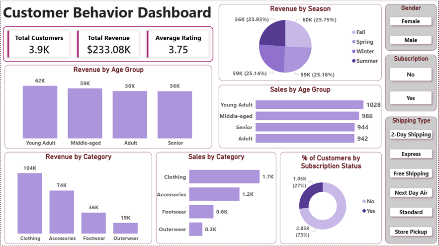

### Customer_Shopping_Behavior_Analysis
End-to-end customer behavior analysis using Python(Pandas), PostgreSQL, and Power BI, uncovering insights on customer segmentation, revenue trends, and business performance.

## Project Overview
This project focuses on analyzing customer behavior in an e-commerce dataset using an end-to-end data analytics workflow. The objective was to extract actionable insights related to customer demographics, product performance, seasonal trends, and subscription behavior.

## Tools & Technologies
**Python (Pandas)** - Data Cleaning & EDA
**PostgreSQL** - Data Storage & Business Querying
**Power BI** - Interactive Dashboard & Visualization

## Project Workflow
1. Performed Data Cleaning & Exploratory data analysis in Python
2. Designed and populated a *PostgreSQL database*
3. Wrote SQL queries to answer key business questions
4. Connected PostgreSQL to Power BI
5. Built an interactive dashboard with filters and KPIs

## Business Questions Answered
- Which season generates the highest revenue?
- Which customer segment contributes the most revenue and sales?
- Which product category contributes the most revenue and sales?
- Which product category performs best?
- What is the subscription adoption rate?
- How does customer behavior vary by gender?
- Which shipping method generated the highest revenue?

## Key Insights
**Revenue & Seasonality**
- *Fall season* generates the highest overall revenue
- Seasonal preferences vary by gender:
          - Females peak in Fall
          - Males peak in Winter

 **Customer Segmentation**
- Young Adults are the highest revenue and sales contributors overall.
- Gender variation observed:
         Males - Young Adults dominate
         Females - Middle-aged group drives highest sales

**Product Performance**
- *Clothing* is the top-performing category in both revenue and sales.
- Consistent performance across all customer segments

**Subscription Insights**
- Majority of customers are not subscribed.
- *No Female* customers are subscribed.
- Male customers show partial subscription adoption (~1.05K).

**Shipping Behavior**
- *Free Shipping* generates the highest revenue.
- *Next Day Air* generates the lowest revenue, indicates strong preference for cost-saving options.

**Gender-Based Analysis**
- Male customers contribute significantly higher revenue ($157.89K) than females ($75.19K)
- This aligns with customer distribution:
       Males: 2.65K
       Females: 1.25K
- Revenue difference is primarily driven by customer volume.

## Business Recommendations
-Improve female customer engagement, especially for subscriptions
- Introduce targeted campaigns for underrepresented segments
- Promote free shipping thresholds to maximize conversions
- Re-evaluate premium shipping strategies
- Focus marketing efforts on Young Adults and Clothing category

## Dashboard Preview

